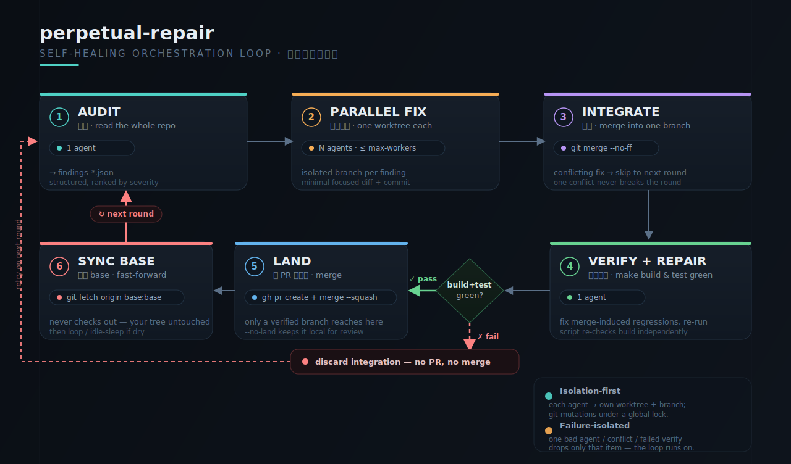
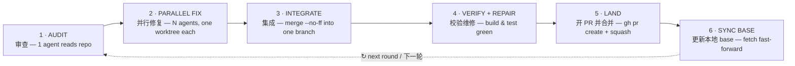

# perpetual-repair

**[English](#english) · [中文](#中文)**

A long-running script that drives the [`claude`](https://docs.anthropic.com/en/docs/claude-code) headless CLI to run a closed loop over a git repository — automatically finding and fixing issues, opening PRs, and merging them, forever.

一个长驻脚本，驱动 [`claude`](https://docs.anthropic.com/en/docs/claude-code) headless CLI，对一个 git 仓库按闭环不停运转，自动发现并修复问题、开 PR、合并。

> **audit → parallel fix → integrate → verify+repair → open & merge PR → sync local base → loop**
>
> **审查 → 并行修复 → 集成 → 校验+维修 → 开 PR 并合并 → 更新本地 base → 循环**

<p align="center">
  
</p>



---

<a name="english"></a>
## English

### The loop

- **Audit** — one agent reads the whole repository and produces structured findings (written to `.perpetual-repair/findings-*.json`).
- **Parallel fix** — each finding is handed to an independent agent, each working in its own isolated git worktree + branch, so they never overwrite each other. Concurrency is capped by `--max-workers` (default 3).
- **Integrate** — each fix branch is `merge --no-ff`'d into a single integration branch; a fix that conflicts is automatically skipped and left for a later round, so one conflict never ruins the whole round.
- **Verify + repair** — one agent runs build / test on the integration branch and fixes any regressions the merge introduced, until green; the script then independently re-checks the build once more.
- **Land** — `gh pr create` + `gh pr merge --squash`, then the local base branch is fast-forwarded to the remote (no checkout, your working tree is never touched).
- **Perpetual** — round after round; after several rounds with no new findings it goes into a long idle sleep, then audits again. `Ctrl-C` exits gracefully after the current round finishes (press again to force-quit).

Works on a repository in **any language** — the verification commands are configurable (default is Go; swap in any `build` / `test` command).

### Dependencies

- [`claude`](https://docs.anthropic.com/en/docs/claude-code) (Claude Code CLI, headless `-p` mode)
- `git`, `python3` (standard library only)
- [`gh`](https://cli.github.com/) (logged in) — only needed for landing (open PR / merge)
- The verify stage defaults to Go commands; use `--build-cmd` / `--test-cmd` for any other language

### Usage

```bash
# Perpetual mode: audit -> parallel fix -> verify -> auto open & merge PR, forever
python3 perpetual_repair.py --repo /path/to/your/repo

# Single round only
python3 perpetual_repair.py --repo /path/to/repo --max-rounds 1

# Audit and print the plan only — touches no code (safest; see what it finds first)
python3 perpetual_repair.py --repo /path/to/repo --dry-run --max-rounds 1

# Fix + verify, but do not open a PR or merge (integration branch stays local for review)
python3 perpetual_repair.py --repo /path/to/repo --no-land

# Non-Go project: swap the verify commands
python3 perpetual_repair.py --repo /path/to/repo \
  --build-cmd "npm run build" --test-cmd "npm test"
```

Run it long-lived in the background:

```bash
nohup python3 perpetual_repair.py --repo /path/to/repo > repair.log 2>&1 &
echo $! > repair.pid          # record the PID
tail -f repair.log            # watch progress
kill -INT "$(cat repair.pid)" # graceful stop (after the current round)
```

### Common options

| Option | Default | Description |
|---|---|---|
| `--repo` | current dir | repository root |
| `--base-branch` | `main` | base / merge-target branch |
| `--remote` | `origin` | remote name |
| `--max-workers` | `3` | max parallel fix agents (controls memory) |
| `--max-findings` | `5` | max issues handled per round (controls PR size) |
| `--max-rounds` | `0` | 0 = unlimited |
| `--idle-seconds` | `300` | sleep after a round with no findings |
| `--build-cmd` / `--test-cmd` | `go build ./...` / `go test ./...` | verify commands |
| `--audit-model` / `--fix-model` / `--verify-model` | empty (use default) | per-stage model alias, e.g. `sonnet` |
| `--no-land` | off | do not open a PR or merge |
| `--no-push` | off | do not push to remote (local integration only) |
| `--dry-run` | off | audit and print the plan only |
| `--safe-permission` | off | use `acceptEdits` instead of skipping all permission prompts |

### Design notes

- **Isolation first** — each fix agent gets one worktree + one branch, so parallel work never overwrites itself.
- **Never disturbs your working tree** — all git operations happen in temporary worktrees; the local base is updated via `git fetch origin <base>:<base>` (fast-forward), with no checkout and no impact on your current branch's uncommitted changes. Worktree metadata operations are serialized under a global lock to avoid racing on `index.lock`.
- **Failure-isolated** — a single agent crash / a single conflicting fix / a single failed verification only affects that item in that round, never halting the loop.
- **Observable** — a heartbeat thread prints the current stage every 30 seconds.
- **Runtime artifacts** — findings, PR bodies, etc. are written under `.perpetual-repair/` (already in `.gitignore`).

### Permissions

By default it uses `--dangerously-skip-permissions` so each agent runs fully automatically (edit files, run builds, git, gh).
For something more conservative, add `--safe-permission` to use `acceptEdits` (auto-accepts edits only; everything else may still pause for confirmation).
Run it only on repositories and in environments you trust — it will modify code, commit, and merge to the remote on its own.

---

<a name="中文"></a>
## 中文

### 闭环流程

- **审查**：一个 agent 通读整个仓库，产出结构化 findings（写入 `.perpetual-repair/findings-*.json`）。
- **并行修复**：每个 finding 交给一个独立 agent，各自在隔离的 git worktree + 独立分支里修，互不覆盖。并发数由 `--max-workers` 控制（默认 3）。
- **集成**：把各修复分支 `merge --no-ff` 到一个集成分支；遇冲突的修复自动跳过、留到下一轮，不让一个冲突毁掉整轮。
- **校验+维修**：一个 agent 在集成分支上跑 build / test，修掉合并引入的回归，直到绿；脚本侧再独立复核一次 build。
- **落地**：`gh pr create` + `gh pr merge --squash`，然后把本地 base 分支快进到远端（不切换、不碰你当前工作区）。
- **永续**：循环往复；连续若干轮无新发现则进入长休眠，之后再次审查。`Ctrl-C` 在当前轮结束后优雅退出（再按一次强制退出）。

适用于任何语言的仓库——校验命令可配（默认 Go，可换成任意 `build`/`test` 命令）。

### 依赖

- [`claude`](https://docs.anthropic.com/en/docs/claude-code)（Claude Code CLI，headless `-p` 模式）
- `git`、`python3`（仅标准库）
- 落地（开 PR/合并）时还需 [`gh`](https://cli.github.com/)（已登录）
- 校验阶段默认用 Go 命令，可用 `--build-cmd` / `--test-cmd` 换成任意语言

### 用法

```bash
# 永续模式：审查→并行修复→校验→自动开 PR 并 merge，循环不停
python3 perpetual_repair.py --repo /path/to/your/repo

# 只跑一轮
python3 perpetual_repair.py --repo /path/to/repo --max-rounds 1

# 只审查并打印计划，不动代码（最安全，先看它能发现什么）
python3 perpetual_repair.py --repo /path/to/repo --dry-run --max-rounds 1

# 修 + 校验，但不开 PR、不合并（集成分支留在本地给你 review）
python3 perpetual_repair.py --repo /path/to/repo --no-land

# 非 Go 项目：换校验命令
python3 perpetual_repair.py --repo /path/to/repo \
  --build-cmd "npm run build" --test-cmd "npm test"
```

后台长驻：

```bash
nohup python3 perpetual_repair.py --repo /path/to/repo > repair.log 2>&1 &
echo $! > repair.pid          # 记 PID
tail -f repair.log            # 看进度
kill -INT "$(cat repair.pid)" # 优雅停止（跑完当前轮）
```

### 常用参数

| 参数 | 默认 | 说明 |
|---|---|---|
| `--repo` | 当前目录 | 仓库根目录 |
| `--base-branch` | `main` | 基线/合并目标分支 |
| `--remote` | `origin` | 远端名 |
| `--max-workers` | `3` | 并行修复 agent 上限（控内存） |
| `--max-findings` | `5` | 每轮最多处理几个问题（控 PR 体量） |
| `--max-rounds` | `0` | 0 = 无限 |
| `--idle-seconds` | `300` | 一轮无发现后的休眠 |
| `--build-cmd` / `--test-cmd` | `go build ./...` / `go test ./...` | 校验命令 |
| `--audit-model` / `--fix-model` / `--verify-model` | 空(用默认) | 各阶段模型别名，如 `sonnet` |
| `--no-land` | 关 | 不开 PR、不合并 |
| `--no-push` | 关 | 不推送远端（纯本地集成） |
| `--dry-run` | 关 | 只审查打印计划 |
| `--safe-permission` | 关 | 用 `acceptEdits` 而非跳过全部权限确认 |

### 设计要点

- **隔离优先**：每个修复 agent 一个 worktree + 一个分支，并行不互相覆盖。
- **不破坏你的工作区**：所有 git 操作都在临时 worktree 里做；更新本地 base 用 `git fetch origin <base>:<base>` 快进，不 checkout、不动你当前分支的未提交改动。worktree 元数据操作加全局锁，避免并发争 `index.lock`。
- **失败隔离**：单个 agent 异常 / 单个修复冲突 / 单轮校验不过，都只影响当轮当项，不会让循环停摆。
- **可观测**：心跳线程每 30 秒打一次当前阶段进度。
- **运行态产物**：findings、PR body 等写在 `.perpetual-repair/`（已加入 `.gitignore`）。

### 权限说明

默认用 `--dangerously-skip-permissions` 让各 agent 全自动执行（改文件、跑构建、git、gh）。
如需更保守，加 `--safe-permission` 改用 `acceptEdits`（仅自动接受编辑，其余仍可能停在确认）。
请在你信任的仓库与环境中运行——它会自动改代码、提交并合并到远端。

---

## License

MIT
